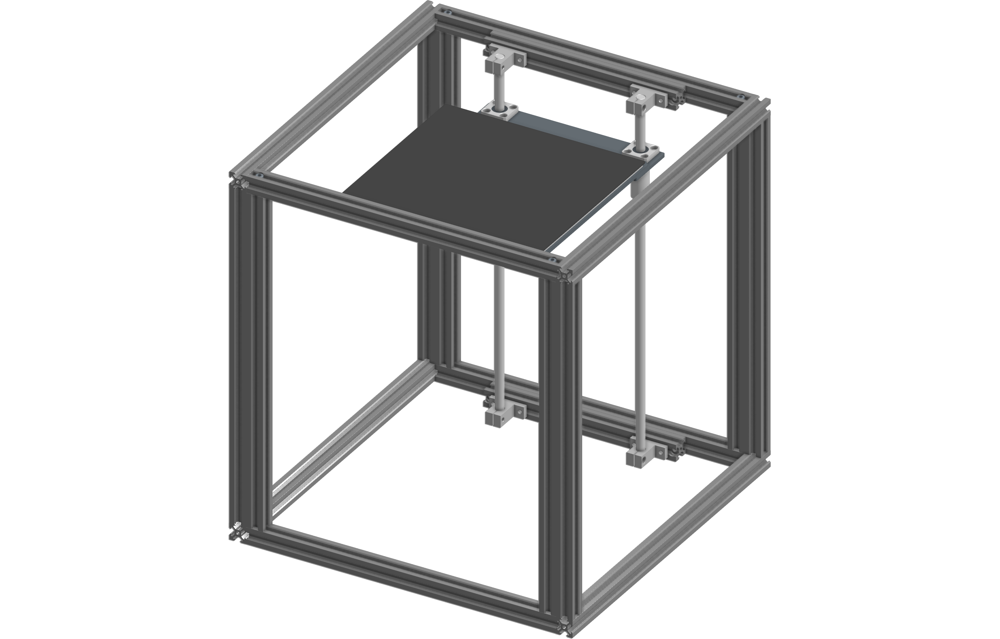
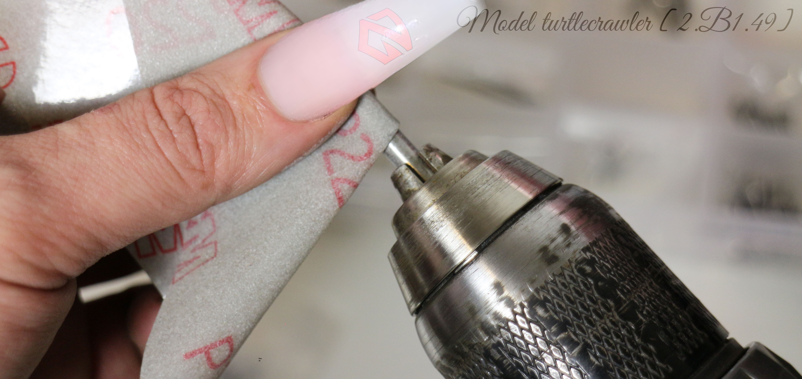
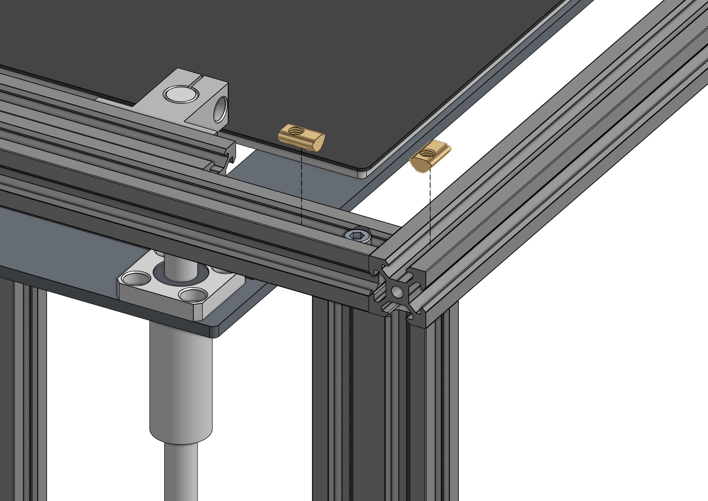
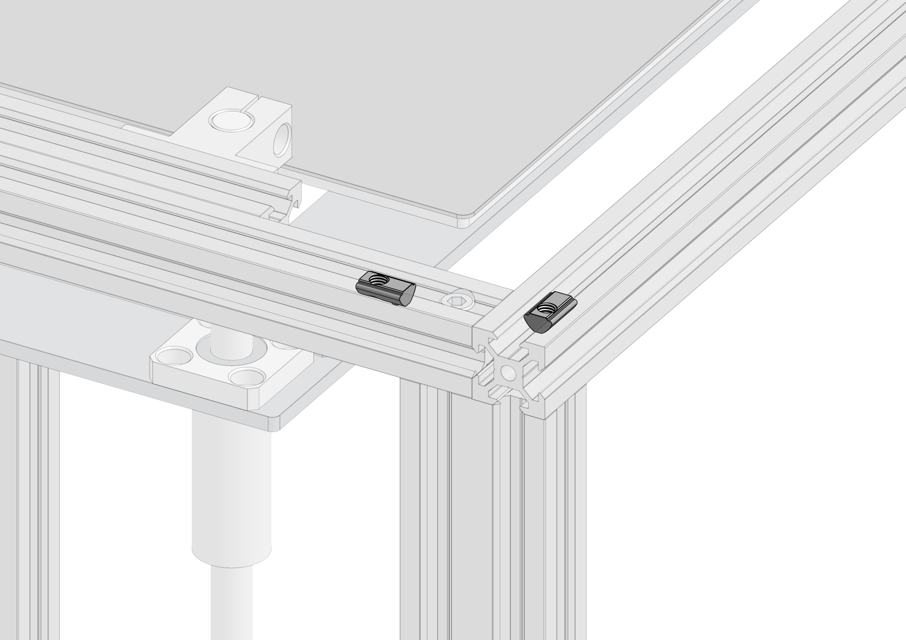
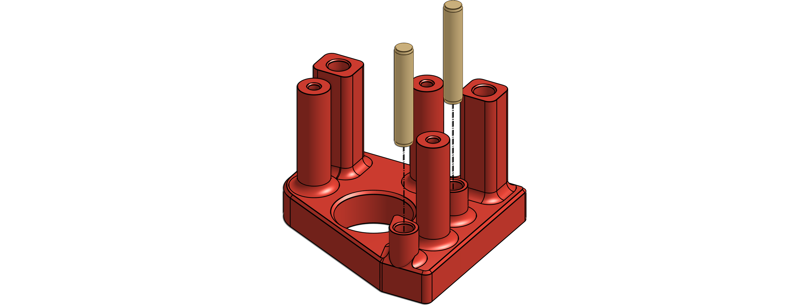
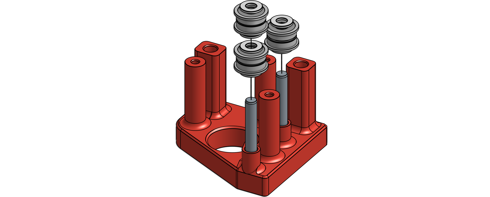
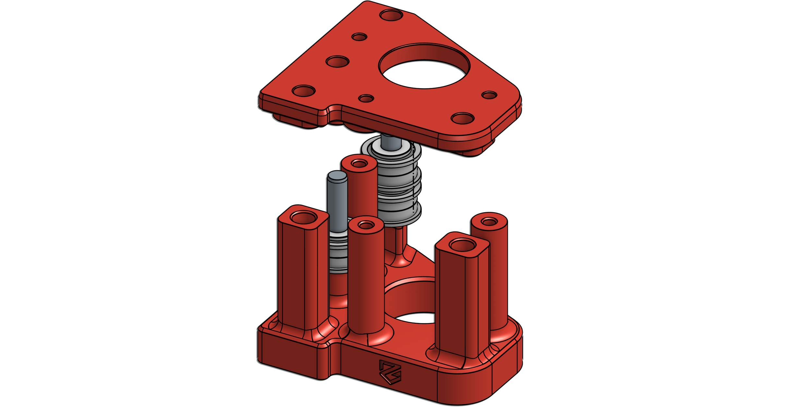

# Mercury One.1 Full Assembly
{: .no_toc }

Welcome to your first steps at assembling your Mercury One.1!

Skill required - medium
{: .label .label-red }

## Section One: Frame

### Empty Frame

For the Mercury One.1 we want to start with the top motion system removed. We're not going into depth on how to remove the X and Y motion system.
If you're having trouble or you would like some help please don't hesitate and ask for help in our [Discord server](https://discord.com/invite/gzJP2s8){:target="_blank"}.

1. Table of content
{:toc}

# Section Two: Stepper mounts

## Left stepper mount
{: class="zoom"}

The hardware displayed below is for __ONE__ stepper mount. INPUT TEXT HERE FOR RIGHT STEPPER MOUNT.

### LS hardware

| :-------------------------: | :--------------------       | -------------------------------------------------------------------------------: |
| Type: Amount: | 5x30 Precision Dowel pin 2          |      |
| Type: Amount: | M3X20mm 3                           |      |
| Type: Amount: | M5X50mm 2                           |      |
| Type: Amount: | [Flange stack](#flange-stack) 3     |  |
| Type: Amount: | 20Tooth Pulley 1          |      |
| Type: Amount: Note: | M5 T-Nut 2 Read more    |  |
| Type: Amount: | Nema 17 Stepper Motor 1                            |  |
{: class="hardwaretable"}

### LS printed parts

| :-------------------------: | :--------------------       | -------------------------------------------------------------------------------: |
| Type: Amount: | Left stepper top 1        |      |
| Type: Amount: | Left stepper bottom 1     |      |
{: class="hardwaretable"}

We have very specific settings you should print the parts with, they've been designed around these settings. Read more about them.

## Sanding the dowel pins

Test fit your dowel pin in the F695-2RS 5\*13\*4 Mm bearing, if they're tight **DO NOT** continue. You want to sand them down a little. 

#### Why do I have to sand my dowel pins?

If they do fit nicely you do not need to sand them down. 

Forcing the dowel pins into the F695-2RS Bearings might cause one of the following issues:

1. The F695-2RS Bearing might crack and split.
2. The dowel pin will never come out again.

  
Click to expand for instructions!

  
    Insert your pins into an electric drill and grab your sandpaper

    <dl>
        <dt>Sandpaper grit</dt>
        <dd>120 to 220</dd>
    </dl>

    ) |

## Left stepper mount assembly

### Inserting the T-nuts

Insert the two M5 T-Nuts into the frame. If you happen to have the T-Nuts without the springs you can skip this step and attach them to the M5x50mm bolts later.

You can slightly rotate the M5 T-nuts while pressing them into the frame. They will snap into place.

The placement of the T-nuts is not important, as long as the threaded holes are facing the right directions as shown on the image below.

The image below shows the correct placement of the T-nuts.

### Inserting dowel pins - LS

Take the bottom left stepper mount *printed part* and insert two 5x30 dowel pins as shown in the image below.

{: class="zoom2"}

The image below shows the correct placement of the dowel pins.

{: class="zoom2"}

>>> ``On the bottom of the printed part you will find small M3 holes below the dowel pins. If your dowel pins are stuck you can use those to press them out using a small hex key.``

### Adding the flange stacks

It's time to add the [flange stack](#flange-stack)! Don't know what those are? [Click here](#flange-stack).

{: class="zoom2"}

The image below shows the correct placement of the [flange stack](#flange-stack).

{: class="zoom2"}

When placing the double flange stacks, make sure you do not remove any shim rings, there will be two on top of each other as shown in the image below.

{: class="zoom2"}

### Lowering the top stepper mount

Take the top left motor mount *printed piece* and lower it into the bottom left motor mount.

| :-------------------------: | :--------------------       | -------------------------------------------------------------------------------: |
| Type: | Left stepper top        |      |
{: class="hardwaretable"}

{: class="zoom2"}

The image below shows the top lowered on the bottom mount, top top will have an edge/guide where the bottom part will fit in.
There should be some play, this because it makes it easier to align.

{: class="zoom2"}

# Definitions

## Flange stack

The following image represents a so called "flange stack".
It contains the following:

| :-------------------------: | :------------------------------------------------------------------------------- | |
| Type: Amount: | 5x10x1 Shim ring 2       |      |
| Type: Amount: | F695-2RS 5\*13\*4 Mm 2       |      |
{: class="hardwaretable"}

1. Assemble the Flange Stack as per following image.

