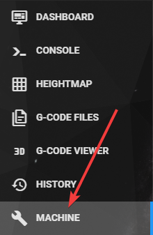
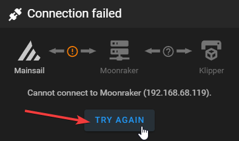

# Mainsail theme

Mainsail custom theme installation instructions.
{: .fs-6 .fw-300 }

Skill required - easy
{: .label .label-red }

[Screenshot](#screenshot)

---

<details closed markdown="block">
  <summary>
    Table of contents
  </summary>
1. TOC
{:toc}
</details>


## Connect to SSH

1) Launch your SSH client, in my case [Putty](https://www.putty.org/){:target="_blank"}.

{: class="roundcorners"}

2) Enter your Raspberry's local IP address in the "Host" or "Server" field.

3) Follow the prompts to connect to your Raspberry. Note that your local IP address may differ from the one used in the example.

---

### SSH console

Your console should appear similar to this.

{: class="roundcorners"}

---

### Console Commands

Paste the following code into your console.

```bash
    cd ~/
    git clone https://github.com/ZeroGDesign/zerog-mainsail-theme.git
    bash ~/zerog-mainsail-theme/install.sh
```

After pasting them into the console, it should resemble this.

{: class="roundcorners"}


{: .warn }
The input field still shows a command we have to run, press **ENTER** on your keyboard to run the command.

Once executed, your console should display the message  '*Theme has been installed, have fun!*' indicating that this step is now complete.

{: class="roundcorners"}

---

## Machine Settings

For the next step of the instructions, you will be using your web client.
{: .fs-6 .fw-300 }

To begin, open the web client of your printer. On the left-hand side of the interface, locate the menu and click on '*Machine*'.

{: class="roundcorners"}

---

### Config Files

Locate the file '*moonraker.conf*' and click on it.

{: class="roundcorners"}

---

## Adding Update Script

Scroll down until you find the text *[update_manager]*.

{: .note }
If you see an additional line that reads "enable_auto_refresh: True", do not remove it. Simply proceed to the next line. Note that this line may not be present for all users.

{: class="roundcorners"}

Insert the following code:

```s
[update_manager client ZeroGTheme]
type: git_repo
path: ~/zerog-mainsail-theme
origin: https://github.com/ZeroGDesign/zerog-mainsail-theme.git
install_script: install.sh
is_system_service: False
```

---

Your configuration should now resemble the following:

{: class="roundcorners"}

---

### Save & Restart

Click on the **Save & Restart** button.

{: class="roundcorners"}

---

### Restart Moonraker

If a notification appears asking you to **try again**, click on it to proceed.

{: class="roundcorners"}

---

### Refresh your browser

Refresh your browser to check if the ZeroG theme is now visible.

{: class="roundcorners"}

---

### Update manager

On the right-hand side, you will see the **Update Manager**. You should now notice that **ZeroGTheme** has been added. This will enable you to easily obtain the latest updates as they become available for the ZeroG Mainsail Theme.

{: class="roundcorners"}

---

### Screenshot

You now have a fresh new theme to enjoy. With its sleek new design, your ZeroG experience just got a whole lot better. So sit back and enjoy the ride - the view has never looked better!

{: class="roundcorners"}
